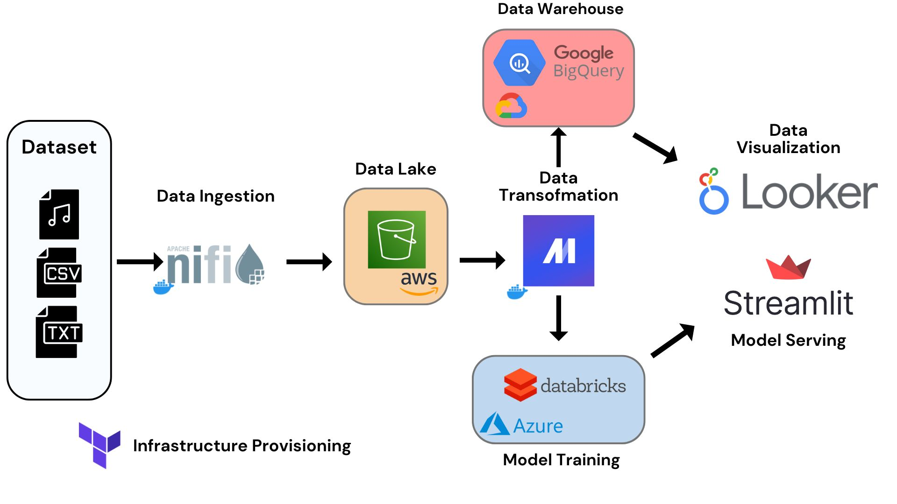

# Triple Cloud Respiratory Sound Pipeline

## 📝 Personal Context

This project was undertaken after I received confirmation that I would be joining Deloitte as a Data & Cloud Intern. To gain practical experience with the three major cloud providers in a real data scenario, I worked on this academic project along with my classmates to simulate a real-world data pipeline across multiple cloud environments, integrating key data technologies from Google Cloud, AWS, and Azure.

## ⚠️ Notice
Code for this project will drop soon.

## 🛠️ Architecture

 

   
     

 
